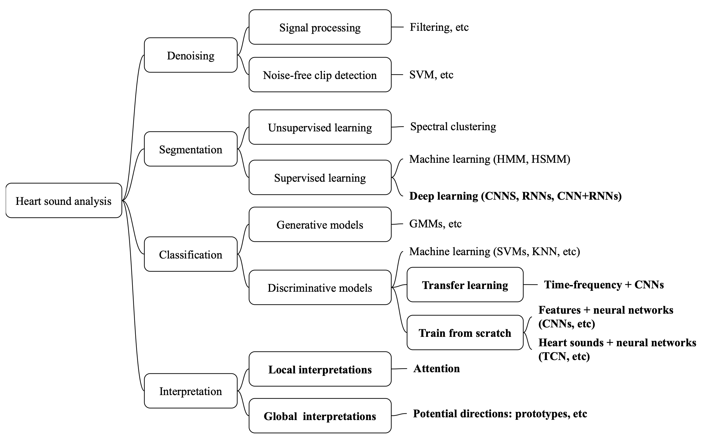

# A comprehensive survey on heart sound analysis in the deep learning era

[](https://awesome.re)
[](https://arxiv.org/abs/2301.09362)
[](https://zhaoren.one/awesome-heart-sound-analysis/)

[](https://hits.seeyoufarm.com)

This repository is a collection of academic articles, publiched methodologies, and datasets during 2017–2022, on the topic of **heart sound analysis**.

The paper **A comprehensive survey on heart sound analysis in the deep learning era** was accepted by [IEEE Computational Intelligence Magazine](https://ieeexplore.ieee.org/xpl/RecentIssue.jsp?punumber=10207) (IF 2024: 9) in 2024.

Content
- [Surveys](#Surveys)
- [Taxonomy](#Taxonomy)
- [Datasets](#Datasets)
- [Publicly-available codes](#Publicly-available-codes)


## Citation
Please read and cite our paper: [](https://arxiv.org/abs/2301.09362)

>Ren, Z., Chang, Y., Nguyen, T. T., Tan, Y., Qian, K., & Schuller, B. W. (2023). A comprehensive survey on heart sound analysis in the deep learning era. IEEE Computational Intelligence Magazine, accepted, to appear.

```
@article{ren2023comprehensive,
  title={A comprehensive survey on heart sound analysis in the deep learning era},
  author={Ren, Zhao and Chang, Yi and Nguyen, Thanh Tam and Tan, Yang and Qian, Kun and Schuller, Bj{\"o}rn W},
  journal={IEEE Computational Intelligence Magazine},
  year={2024}
  note={accepted, to appear}
}
```

OR

>Ren, Z., Chang, Y., Nguyen, T. T., Tan, Y., Qian, K., & Schuller, B. W. (2023). [A comprehensive survey on heart sound analysis in the deep learning era](https://arxiv.org/abs/2301.09362). arXiv preprint arXiv:2301.09362.

```
@article{ren2023comprehensive,
  title={A comprehensive survey on heart sound analysis in the deep learning era},
  author={Ren, Zhao and Chang, Yi and Nguyen, Thanh Tam and Tan, Yang and Qian, Kun and Schuller, Bj{\"o}rn W},
  journal={arXiv preprint arXiv:2301.09362},
  year={2023}
}
```

## Surveys
| Paper Title | Venue | Year |
|----------|----------|----------|
|[Multidimensional analytical study of heart sounds: A review](https://biomed.bas.bg/bioautomation/2015/vol_19.3/files/19.3_07.pdf)|International Journal Bioautomation|2015|
|[Phonocardiogram signal analysis-practices, trends and challenges: A critical review](https://ieeexplore.ieee.org/abstract/document/7344426) | IEMCON|2015 |
|[A review of intelligent systems for heart sound signal analysis](https://www.tandfonline.com/doi/abs/10.1080/03091902.2017.1382584) |Journal of Medical Engineering & Technology |2017 |
|[Recent advances in heart sound analysis](https://iopscience.iop.org/article/10.1088/1361-6579/aa7ec8/meta) |Physiological Measurement |2017 |
|[Heart sound data acquisition and preprocessing techniques: A review](https://www.igi-global.com/chapter/heart-sound-data-acquisition-and-preprocessing-techniques/251149) |IGI Global |2020 |
|[Application of soft computing techniques to heart sound classification: A review of the decade](https://www.taylorfrancis.com/chapters/edit/10.1201/9781003003496-7/application-soft-computing-techniques-heart-sound-classification-babita-majhi-aarti-kashyap) |Soft Computing Applications and Techniques in Healthcare |2020 |
|[Algorithms for automatic analysis and classification of heart sounds – A systematic review](https://ieeexplore.ieee.org/abstract/document/8586788) |IEEE Access |2018 |


## Taxonomy
[](https://arxiv.org/abs/2301.09362)

## Datasets
| Dataset | Challenge | Task |
|----------|----------|----------|
|[PASCAL Database](http://www.peterjbentley.com/heartchallenge/index.html)|[PASCAL Challenge](http://www.peterjbentley.com/heartchallenge/index.html)|Dataset A: Normal, Murmur, Extra Heart Sound, Artifact; Dataset B: Normal, Murmur, Extrasystole|
|[PhysioNet/CinC Database](https://iopscience.iop.org/article/10.1088/0967-3334/37/12/2181/meta)|[PhysioNet/CinC Challenge 2016](https://www.ahajournals.org/doi/abs/10.1161/01.cir.101.23.e215)|Normal, Abnormal, Too noisy or ambiguous|
|[HSS](https://ieeexplore.ieee.org/abstract/document/8910340)|[ComParE Challenge 2018](https://www.isca-archive.org/interspeech_2018/schuller18_interspeech.pdf)|Normal, Mild, Moderate/Severe|
|[Data on GitHub](https://www.mdpi.com/2076-3417/8/12/2344)|--|Normal, AS, MR, MS, MVP|
|Michigan Heart Sound Database, link [1](https://open.umich.edu/find/open-educational-resources/medical/heart-sound-murmur-library) and [2](https://www.med.umich.edu/lrc/psb_open/html/repo/primer_heartsound/primer_heartsound.html)|--|Normal, Pathological|
|[CirCor DigiScope Database](https://ieeexplore.ieee.org/abstract/document/9658215)|[George B. Moody PhysioNet Challenge 2022](https://journals.plos.org/digitalhealth/article?id=10.1371/journal.pdig.0000324)|Normal, abnormal; presence, absence, or unclear cases of murmurs|

## Publicly-available codes

| Paper Title | Code Link | Program Language | Model  |
|----------|----------|----------|----------|
|[Classification of heart sound signal using multiple features](https://www.mdpi.com/2076-3417/8/12/2344) |https://github.com/yaseen21khan/Classification-of-Heart-Sound-Signal-Using-Multiple-Features-|Matlab|DNN|
|[Towards domain invariant heart sound abnormality detection using learnable filterbanks](https://ieeexplore.ieee.org/abstract/document/8977359) |https://github.com/mhealthbuet/heartnet|Python|CNN|
|[A robust interpretable deep learning classifier for heart anomaly detection without segmentation](https://ieeexplore.ieee.org/abstract/document/9210180) |https://github.com/mHealthBuet/CepsNET|Python|ResNet|
|[Algorithm for predicting valvular heart disease from heart sounds in an unselected cohort](https://www.frontiersin.org/articles/10.3389/fcvm.2023.1170804/full) |https://github.com/uit-hdl/heart-sound-classification|Matlab|--|
